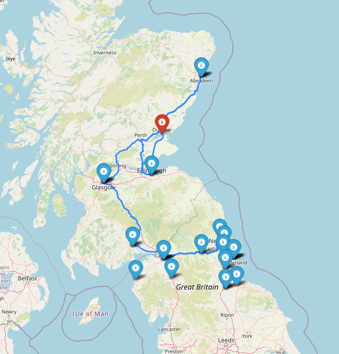
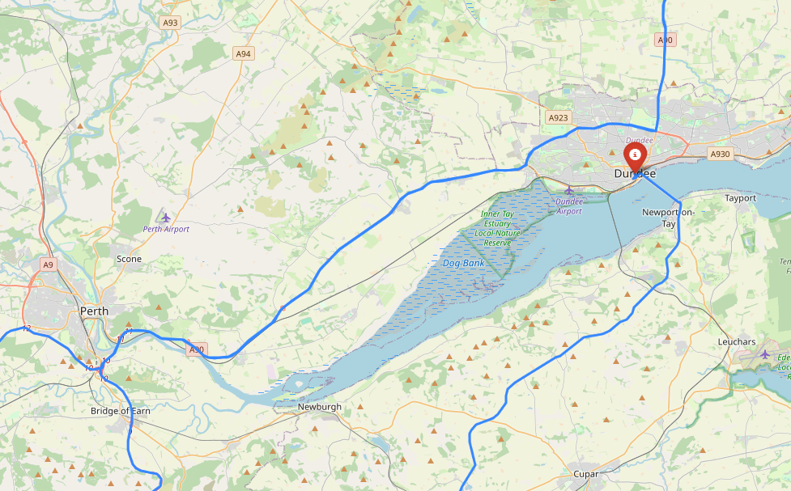
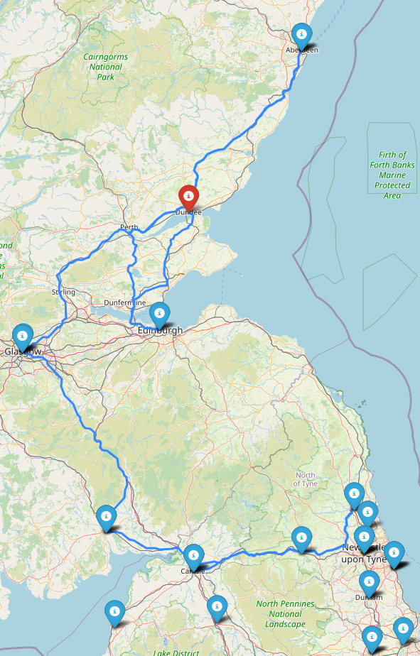

# Catch The Fish Bandit
## ***A Quackathon 2024 - NCR Challenge Winning Project***

## Collaborators
- [Kamil Krauze](https://github.com/KamilKrauze)
- [Vera Borvinski](https://github.com/veraborvinski)
- [Isaiah Intina](https://github.com/Intina47)
- [Rares Comanici](https://github.com/rarescomanici)

> This repo consists of 3 production branches:
> - [frontend (main)](https://github.com/KamilKrauze/CatchTheFishBandit)
> - [georouter-api](https://github.com/KamilKrauze/CatchTheFishBandit/tree/geo-router)
> - [geodata-api](https://github.com/KamilKrauze/CatchTheFishBandit/tree/geo-data)

> There is a CI/CD pipeline setup using GitHub actions that uploads code the cloud everytime there is change detected per branch:
>  
> [Here is an example of it](https://github.com/KamilKrauze/CatchTheFishBandit/blob/frontend/.github/workflows/build-container.yml)

The entire project runs on docker containers that run Python Flask web-applications that are hosted but not exclusively on GCP as a microservice infrastructure.

---
## Overview
> ### The Frontend
> This is the web-app's frontend and the index page where it communicates with other API's to deliver the service.

> ### The Georoute-API
> This is a separate application where it plots routes per request using python libraries, it takes the user-device location or some arbitrary user specified location and plots the most optimal route to each ATM location provided by the Geodata-API.

> ### The Geodata-API
> This is a very simple service that provides latitudinal and longitudinal coords of each ATM on the map per request.

## Routemap Preview
| Farout                     | Dundee                     | Closeup                      |
|----------------------------|----------------------------|------------------------------|
|  |  |  |
